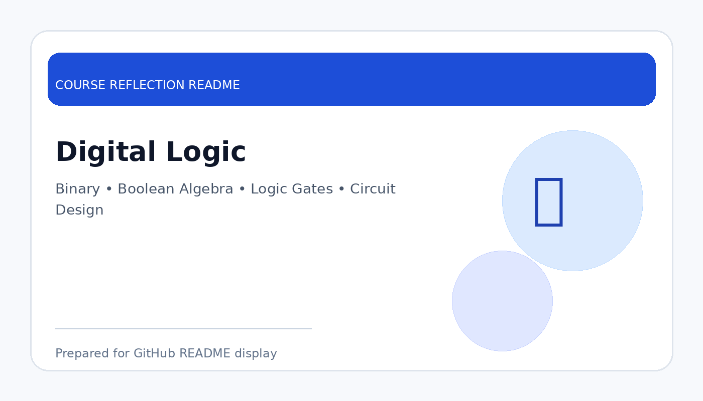

# Digital Logic

  

  <b>Course Reflection README</b>

---

## Course Overview

This course covers the basic principles of digital systems, including binary numbers, Boolean algebra, logic gates, combinational circuits, sequential circuits, and digital circuit design.

---

## Reflection

This course helped me understand the basic building blocks of digital computers. By learning binary numbers, Boolean algebra, and logic gates, I realised that complex computer systems are built from simple logical operations.

The course trained me to think logically and solve problems step by step. Topics such as truth tables, Karnaugh maps, adders, multiplexers, flip-flops, and counters showed me how digital circuits process information and make decisions based on binary inputs.

Overall, Digital Logic gave me a strong foundation in understanding how hardware performs logical operations. It also improved my analytical thinking, which is useful for programming, computer architecture, and system design.

---

## Key Takeaways

- Learned binary representation and Boolean logic.
- Understood the function of logic gates and digital circuits.
- Practised simplifying logic expressions and designing circuits.
- Improved structured and logical problem-solving skills.

---

## Conclusion

In conclusion, **Digital Logic** has provided useful knowledge and skills that are important for my academic development and future career. The course helped me improve my understanding, strengthen my learning foundation, and become more prepared to apply these concepts in real-world computing and professional situations.
