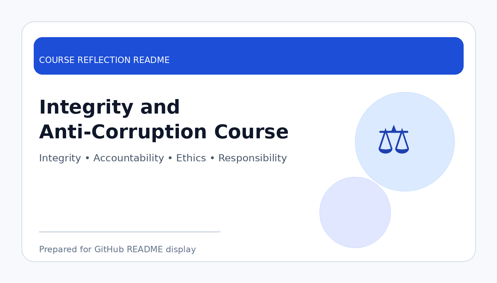

# Integrity and Anti-Corruption Course

  

  <b>Course Reflection README</b>

---

## Course Overview

This course introduces the importance of integrity, accountability, transparency, responsibility, and anti-corruption values in personal, academic, and professional life.

---

## Reflection

This course helped me understand that integrity is an important value that should be practised in daily life, not only discussed in theory. It reminded me that honesty, responsibility, and accountability are important in academic work, teamwork, leadership, and future career situations.

One important lesson from this course is that corruption does not only happen in large organisations or government sectors. It can begin from small dishonest actions, such as cheating, misuse of power, favouritism, or avoiding responsibility. Because of this, every individual has a role in preventing unethical behaviour.

Overall, this course strengthened my awareness of ethical responsibility. It encouraged me to make decisions based on honesty and fairness, and to build a strong personal character before entering the working environment.

---

## Key Takeaways

- Understood the meaning of integrity and accountability.
- Recognised the impact of corruption on society and organisations.
- Learned the importance of honesty in study and work.
- Developed stronger awareness of ethical decision-making.

---

## Conclusion

In conclusion, **Integrity and Anti-Corruption Course** has provided useful knowledge and skills that are important for my academic development and future career. The course helped me improve my understanding, strengthen my learning foundation, and become more prepared to apply these concepts in real-world computing and professional situations.
