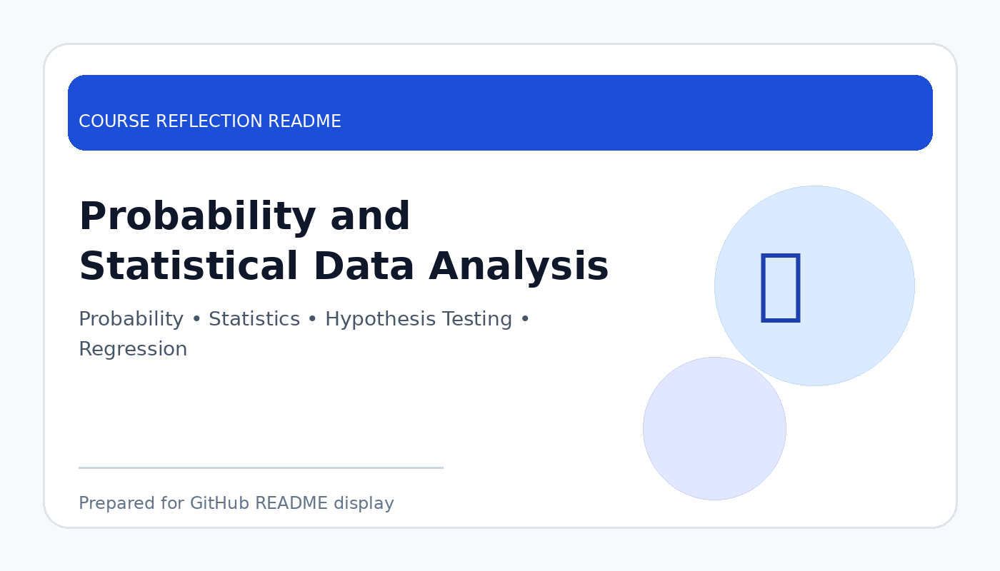

# Probability and Statistical Data Analysis

  

  <b>Course Reflection README</b>

---

## Course Overview

This course introduces probability concepts and statistical methods used to analyse data, interpret patterns, make predictions, and support decision-making.

---

## Reflection

This course helped me understand how data can be analysed and interpreted using probability and statistical methods. Instead of only looking at raw numbers, I learned how to identify patterns, measure uncertainty, and make conclusions based on evidence.

Topics such as probability distributions, descriptive statistics, hypothesis testing, correlation, and regression showed me how statistics supports decision-making in real situations. The course also helped me realise that data analysis must be done carefully because wrong interpretation can lead to wrong conclusions.

Overall, this course strengthened my data analysis foundation. It is very useful for my studies in data engineering because statistical thinking is important when working with datasets, dashboards, machine learning, and business insights.

---

## Key Takeaways

- Learned how to describe and interpret data.
- Understood probability, distributions, and uncertainty.
- Practised statistical analysis for decision-making.
- Built stronger foundation for data analytics and machine learning.

---

## Conclusion

In conclusion, **Probability and Statistical Data Analysis** has provided useful knowledge and skills that are important for my academic development and future career. The course helped me improve my understanding, strengthen my learning foundation, and become more prepared to apply these concepts in real-world computing and professional situations.
