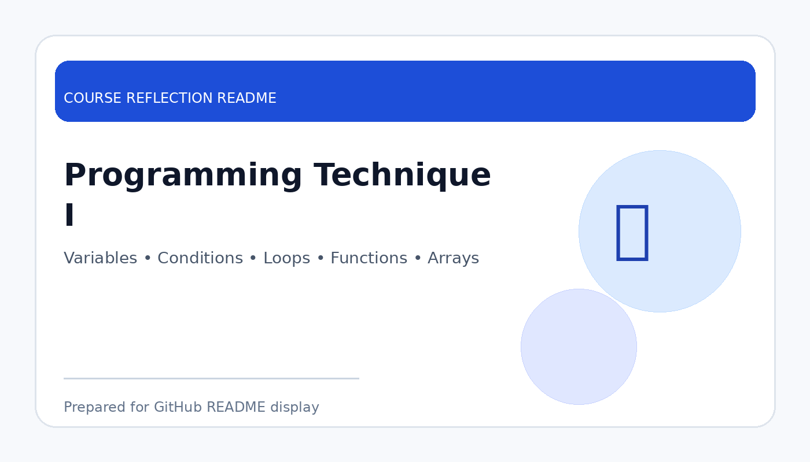

# Programming Technique I

  

  <b>Course Reflection README</b>

---

## Course Overview

This course introduces fundamental programming concepts, including variables, data types, control structures, functions, arrays, input/output, and problem-solving using programming logic.

---

## Reflection

Programming Technique I helped me build the basic foundation of programming. Through this course, I learned how to write simple programs, use variables, apply selection and repetition structures, and break problems into smaller steps.

The course trained me to think logically and carefully when solving programming problems. I learned that programming is not only about writing code, but also about understanding the problem, planning the solution, testing the output, and fixing errors.

Overall, this course gave me confidence to continue learning more advanced programming subjects. The basic concepts learned in this course are important because they are used again in data structures, object-oriented programming, database programming, and software development.

---

## Key Takeaways

- Learned fundamental programming syntax and logic.
- Practised problem-solving using code.
- Understood variables, loops, conditions, functions, and arrays.
- Built confidence for advanced programming subjects.

---

## Conclusion

In conclusion, **Programming Technique I** has provided useful knowledge and skills that are important for my academic development and future career. The course helped me improve my understanding, strengthen my learning foundation, and become more prepared to apply these concepts in real-world computing and professional situations.
