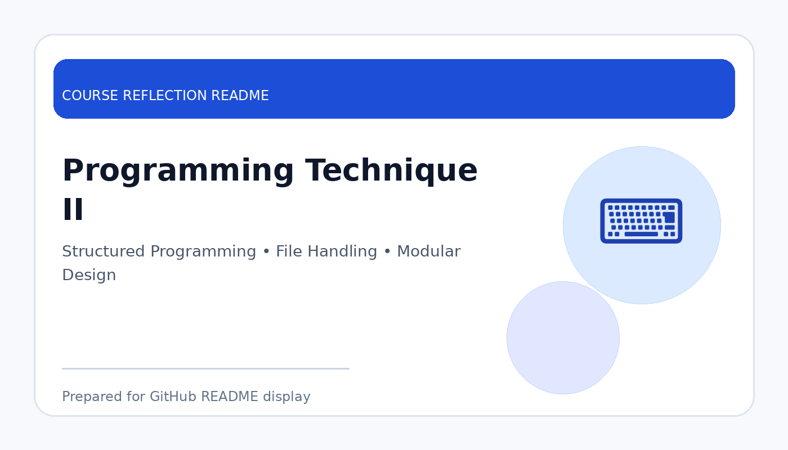

# Programming Technique II

  

  <b>Course Reflection README</b>

---

## Course Overview

This course continues programming development by introducing more structured programming techniques, problem-solving strategies, modular design, file handling, and more complex program implementation.

---

## Reflection

Programming Technique II helped me improve my programming skills beyond the basic level. Compared to the first programming course, this subject required more careful planning, better code structure, and stronger problem-solving ability.

Through this course, I learned how to organise programs more effectively using functions, arrays, structured data, and file handling. It also helped me understand the importance of writing readable, maintainable, and reusable code.

Overall, this course strengthened my confidence in developing larger programs. It also prepared me for more advanced computing subjects because programming technique is a core skill needed in software development, data processing, and system implementation.

---

## Key Takeaways

- Improved structured programming and problem-solving skills.
- Learned to write cleaner and more maintainable code.
- Practised handling more complex programming tasks.
- Prepared for advanced software and data engineering courses.

---

## Conclusion

In conclusion, **Programming Technique II** has provided useful knowledge and skills that are important for my academic development and future career. The course helped me improve my understanding, strengthen my learning foundation, and become more prepared to apply these concepts in real-world computing and professional situations.
