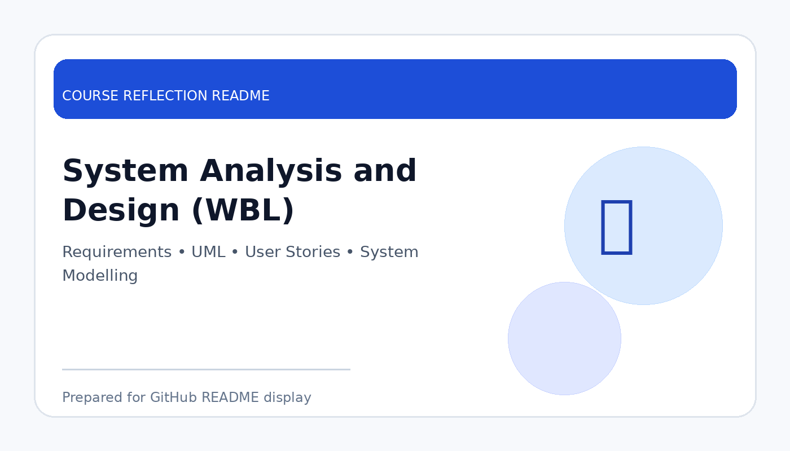

# System Analysis and Design (WBL)

  

  <b>Course Reflection README</b>

---

## Course Overview

This course focuses on analysing user requirements and designing information systems using models, diagrams, documentation, and structured development approaches.

---

## Reflection

System Analysis and Design helped me understand how a system should be planned before it is developed. This course showed me that successful software development does not start from coding directly, but from understanding problems, users, requirements, processes, and system objectives.

Through this course, I learned about requirement analysis, user stories, use case diagrams, system modelling, and design documentation. These activities helped me see the importance of communication between users, developers, and stakeholders when building a system.

Overall, this course improved my ability to analyse real-world problems and translate them into system requirements. It is useful for future software projects because good analysis and design can reduce confusion, improve development quality, and make the final system more suitable for users.

---

## Key Takeaways

- Understood the importance of requirement analysis.
- Learned to model systems using diagrams and documentation.
- Improved ability to connect user needs with system functions.
- Recognised that good design improves software quality.

---

## Conclusion

In conclusion, **System Analysis and Design (WBL)** has provided useful knowledge and skills that are important for my academic development and future career. The course helped me improve my understanding, strengthen my learning foundation, and become more prepared to apply these concepts in real-world computing and professional situations.
