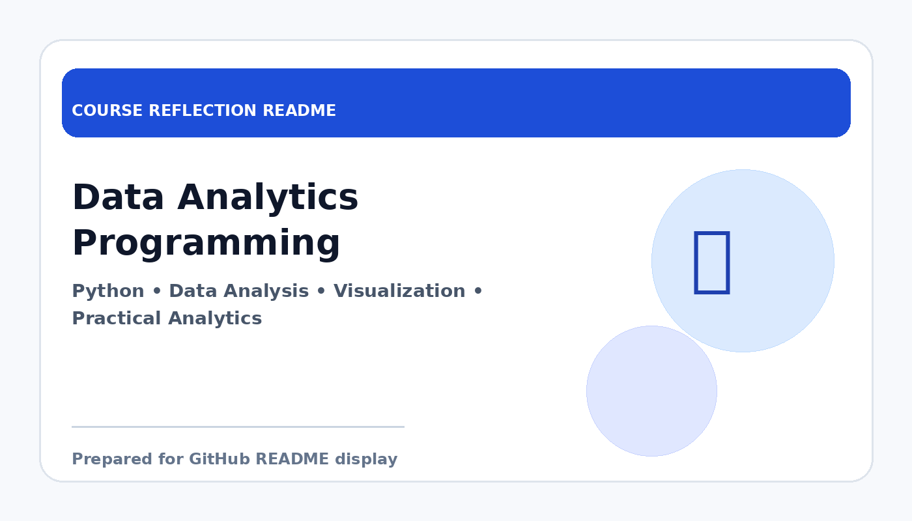

# Data Analytics Programming

  

  <b>Course Reflection README</b>

---

## Course Overview

This course focuses on programming techniques for data analytics, including data cleaning, transformation, analysis, and visualization using programming tools and analytical thinking.

---

## Reflection

This course helped me understand how programming can be applied directly to data analysis. Instead of only writing code for general tasks, I learned how to use programming to clean datasets, explore patterns, and generate meaningful insights from data.

One of the most useful parts of this course was learning how to handle structured data step by step. It strengthened my ability to analyse datasets, apply logic in problem-solving, and present findings in a clearer way. The course also showed me that data analytics requires both technical skills and careful interpretation.

Overall, Data Analytics Programming improved my confidence in using programming for real analytical work. It is especially valuable for my data engineering background because it connects coding skills with data-driven decision-making.

---

## Key Takeaways

- Learned to use programming for data analysis tasks.
- Improved skills in data cleaning and transformation.
- Understood how to interpret and communicate analytical results.
- Built stronger preparation for data science and data engineering work.

---

## Conclusion

In conclusion, **Data Analytics Programming** has provided useful knowledge and skills that are important for my academic development and future career. The course helped me improve my understanding, strengthen my learning foundation, and become more prepared to apply these concepts in real-world computing and professional situations.
