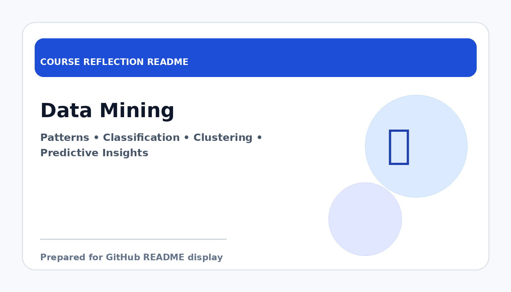

# Data Mining

  

  <b>Course Reflection README</b>

---

## Course Overview

This course introduces methods for discovering useful patterns and knowledge from large datasets, including classification, clustering, association analysis, and predictive modelling.

---

## Reflection

Data Mining helped me understand how hidden patterns and useful knowledge can be extracted from large amounts of data. It showed me that data is not only collected for storage, but also for discovering trends, relationships, and useful predictions.

The course exposed me to important concepts such as classification, clustering, and pattern analysis. These topics helped me appreciate how algorithms can support decision-making in business and technology contexts. It also reminded me that the quality of the data and the interpretation of results are both very important.

Overall, this course strengthened my understanding of intelligent data analysis. It is highly relevant to my field because data mining plays an important role in analytics, machine learning, and real-world problem solving.

---

## Key Takeaways

- Learned how to identify patterns from datasets.
- Understood basic data mining techniques and algorithms.
- Improved ability to interpret analytical outcomes.
- Built foundation for machine learning and predictive analytics.

---

## Conclusion

In conclusion, **Data Mining** has provided useful knowledge and skills that are important for my academic development and future career. The course helped me improve my understanding, strengthen my learning foundation, and become more prepared to apply these concepts in real-world computing and professional situations.
