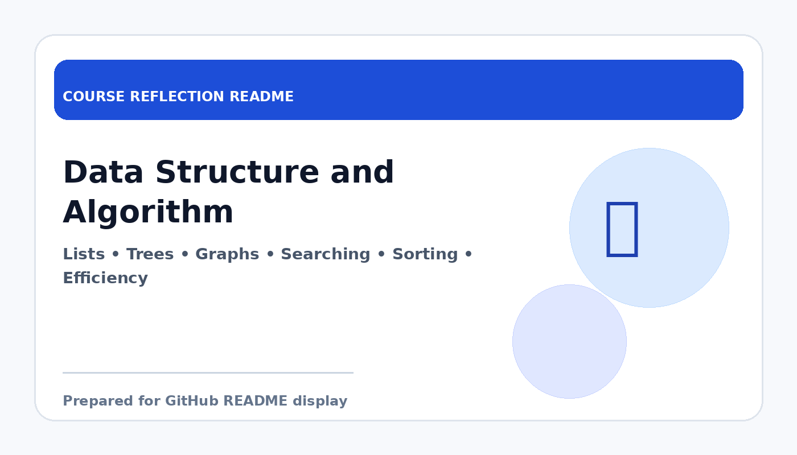

# Data Structure and Algorithm

  

  <b>Course Reflection README</b>

---

## Course Overview

This course introduces important data structures and algorithms used to organise data and solve computational problems efficiently.

---

## Reflection

This course helped me understand that solving a problem in programming is not only about getting the correct output, but also about choosing an efficient way to do it. Learning data structures and algorithms improved the way I think about performance, memory usage, and problem-solving strategies.

Topics such as arrays, linked lists, stacks, queues, trees, graphs, sorting, and searching showed me how different structures are suitable for different situations. The course also made me more aware that algorithm efficiency is important when dealing with larger or more complex systems.

Overall, Data Structure and Algorithm built a very important foundation for my computing studies. It improved my logical thinking and prepared me for advanced software development, database work, and technical interviews in the future.

---

## Key Takeaways

- Learned major data structures and their applications.
- Understood the importance of algorithm efficiency.
- Improved problem-solving and logical thinking skills.
- Built strong foundation for advanced programming and software design.

---

## Conclusion

In conclusion, **Data Structure and Algorithm** has provided useful knowledge and skills that are important for my academic development and future career. The course helped me improve my understanding, strengthen my learning foundation, and become more prepared to apply these concepts in real-world computing and professional situations.
