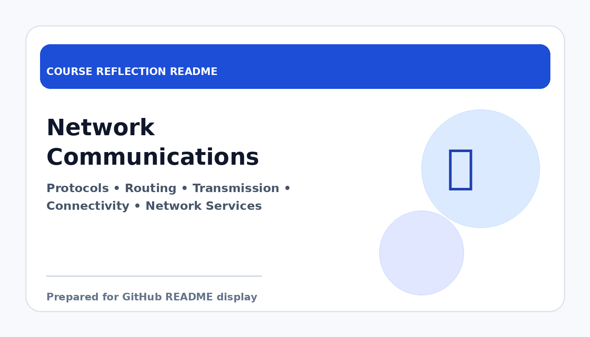

# Network Communications

  

  <b>Course Reflection README</b>

---

## Course Overview

This course introduces the principles of computer networking, including communication protocols, transmission media, addressing, routing, and network services.

---

## Reflection

Network Communications helped me understand how computers and devices connect and exchange information. Before this course, I mainly used networks as a user, but this subject gave me a clearer view of the processes and technologies that make communication possible.

Topics such as network models, IP addressing, protocols, routing, and network services showed me how data travels from one point to another. It also helped me understand the importance of reliable communication, security, and network management in modern systems.

Overall, this course strengthened my understanding of digital communication infrastructure. It is useful because networking is closely related to cloud systems, distributed computing, and many areas of information technology.

---

## Key Takeaways

- Learned the basic concepts of computer networking.
- Understood how protocols and addressing support communication.
- Improved awareness of network reliability and security.
- Built foundation for cloud, distributed systems, and infrastructure topics.

---

## Conclusion

In conclusion, **Network Communications** has provided useful knowledge and skills that are important for my academic development and future career. The course helped me improve my understanding, strengthen my learning foundation, and become more prepared to apply these concepts in real-world computing and professional situations.
