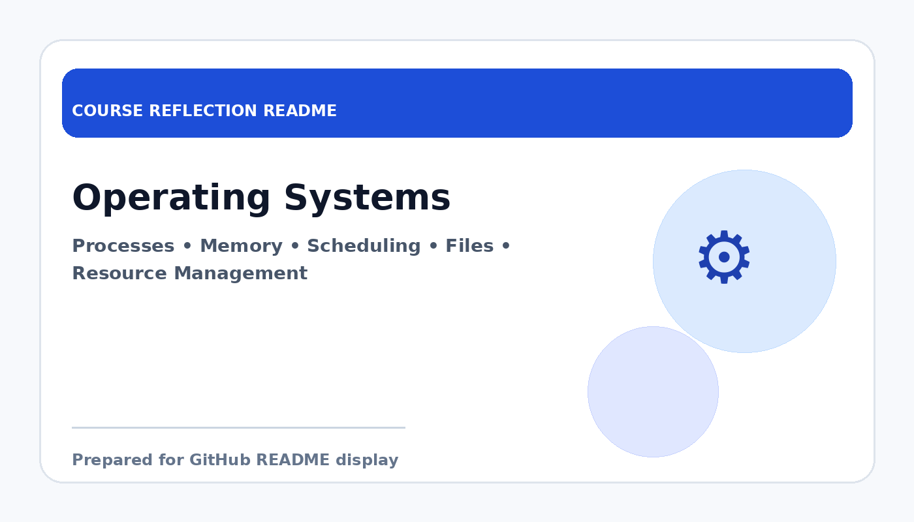

# Operating Systems

  

  <b>Course Reflection README</b>

---

## Course Overview

This course focuses on the functions and design of operating systems, including process management, memory management, scheduling, file systems, and resource allocation.

---

## Reflection

Operating Systems helped me understand the important role of the operating system as the bridge between hardware and software. It showed me that many tasks users take for granted, such as running programs or managing files, depend on complex system-level processes.

Through this course, I learned about processes, threads, memory management, CPU scheduling, and file systems. These topics gave me a better understanding of how system resources are controlled and how efficiency and stability are maintained in a computer environment.

Overall, this course strengthened my technical foundation in computer systems. It is useful because understanding operating systems helps me become a better programmer and gives me a deeper appreciation of how computing environments work.

---

## Key Takeaways

- Learned the major functions of an operating system.
- Understood process, memory, and resource management concepts.
- Improved understanding of system-level computing behaviour.
- Built stronger foundation for system programming and infrastructure.

---

## Conclusion

In conclusion, **Operating Systems** has provided useful knowledge and skills that are important for my academic development and future career. The course helped me improve my understanding, strengthen my learning foundation, and become more prepared to apply these concepts in real-world computing and professional situations.
