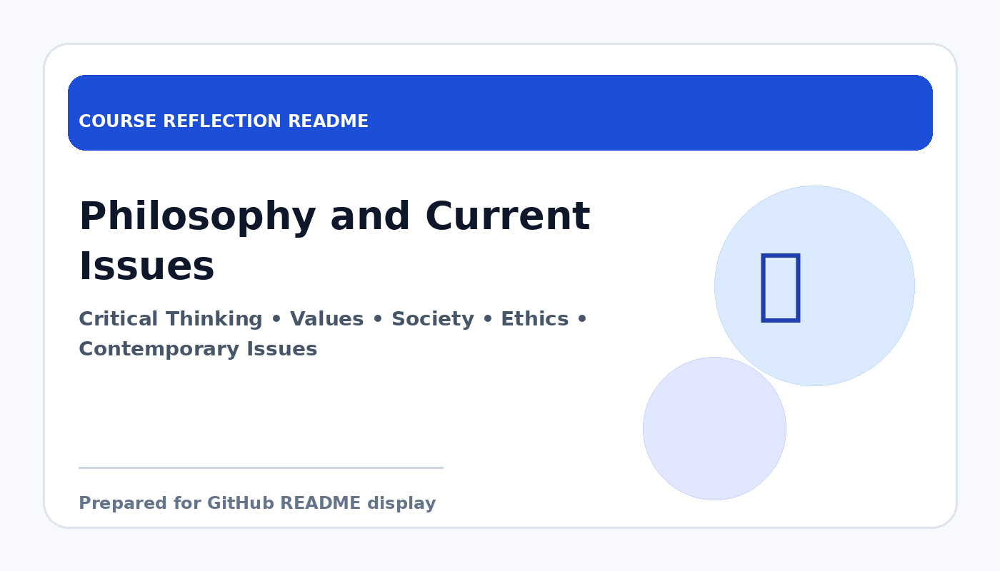

# Philosophy and Current Issues

  

  <b>Course Reflection README</b>

---

## Course Overview

This course encourages students to think critically about philosophical ideas, human values, and current issues affecting society, technology, and daily life.

---

## Reflection

This course helped me become more aware of how philosophical thinking can be connected to current issues in society. It showed me that important questions about values, ethics, identity, and responsibility are still highly relevant in the modern world.

One meaningful lesson from this course is that critical thinking is necessary when discussing contemporary issues. Instead of accepting information immediately, I learned to evaluate arguments, consider different perspectives, and reflect more deeply on the impact of social and technological changes.

Overall, Philosophy and Current Issues broadened my thinking beyond technical subjects. It encouraged me to become more reflective, open-minded, and responsible when facing issues in society and in my future professional life.

---

## Key Takeaways

- Improved critical thinking and reflection skills.
- Learned to connect values and ethics with current issues.
- Became more open to different perspectives and arguments.
- Strengthened awareness of social and personal responsibility.

---

## Conclusion

In conclusion, **Philosophy and Current Issues** has provided useful knowledge and skills that are important for my academic development and future career. The course helped me improve my understanding, strengthen my learning foundation, and become more prepared to apply these concepts in real-world computing and professional situations.
