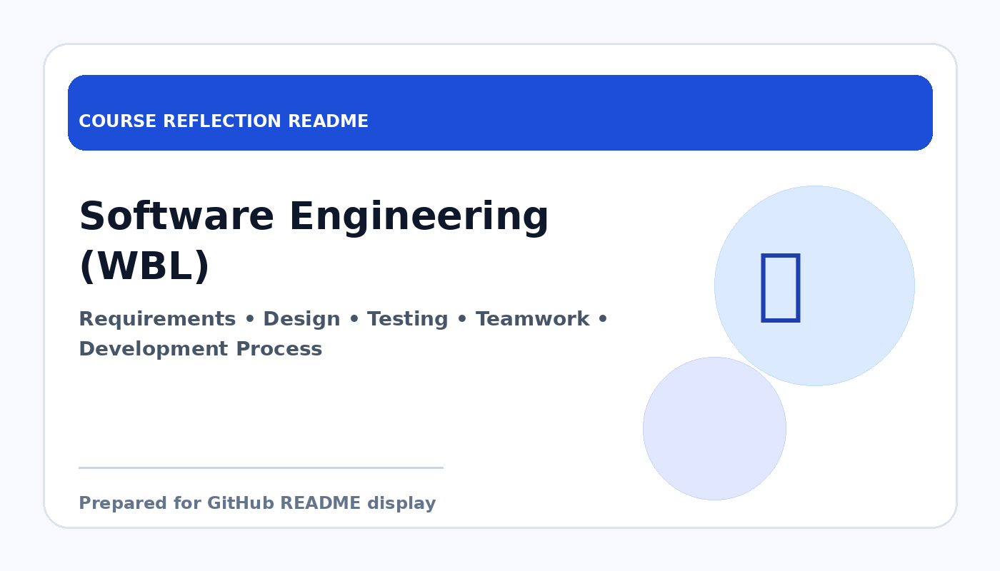

# Software Engineering (WBL)

  

  <b>Course Reflection README</b>

---

## Course Overview

This course focuses on software engineering principles, including software processes, requirements, design, testing, maintenance, and teamwork in software development.

---

## Reflection

Software Engineering helped me understand that developing software is not only about coding, but also about following proper processes and working effectively in a team. This course showed me that quality software depends on planning, communication, documentation, and testing.

Through this course, I learned about requirements analysis, software design, testing, maintenance, and project organisation. These topics made me realise that software development is a structured discipline and that each stage plays an important role in producing reliable systems.

Overall, this course strengthened my awareness of professional software development practices. It is very useful because it prepares me for collaborative projects and real working environments where software quality and process discipline matter.

---

## Key Takeaways

- Understood the full software development lifecycle.
- Learned the importance of testing, documentation, and teamwork.
- Improved awareness of professional software practices.
- Prepared for real-world software development projects.

---

## Conclusion

In conclusion, **Software Engineering (WBL)** has provided useful knowledge and skills that are important for my academic development and future career. The course helped me improve my understanding, strengthen my learning foundation, and become more prepared to apply these concepts in real-world computing and professional situations.
