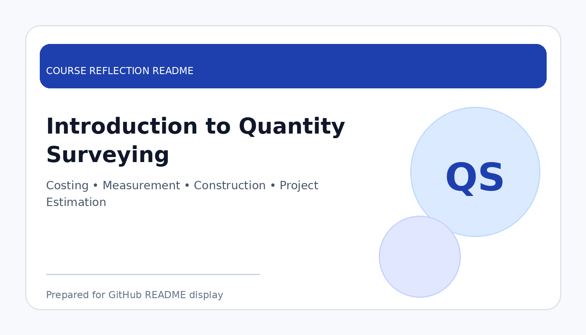

# Application Development (WBL)

  

  <b>Course Reflection README</b>

---

## Course Overview

This course focuses on the development of practical software applications through work-based learning. It introduces the process of planning, designing, developing, testing, and improving an application based on real user needs and project requirements.

---

## Reflection

This course helped me understand how application development is carried out in a real project environment. Through the learning process, I was able to apply programming knowledge, system design concepts, database handling, and user interface development to build a functional application.

The course also improved my understanding of teamwork, communication, task planning, and problem-solving. Since application development involves both technical and user-focused decisions, I learned the importance of writing clean code, managing project progress, testing features, and making improvements based on feedback.

Overall, Application Development (WBL) gave me valuable experience in connecting classroom knowledge with real software development practices. It strengthened my confidence in developing applications that are useful, structured, and aligned with user requirements.

---

## Key Takeaways

- Learned how to plan and develop a complete application.
- Applied programming, database, and interface design skills.
- Improved teamwork, communication, and project coordination.
- Understood the importance of testing, feedback, and continuous improvement.

---

## Conclusion

In conclusion, **Application Development (WBL)** has provided useful experience in real-world software development. The course helped me strengthen my technical skills, improve my project management ability, and become more prepared to develop practical solutions in future academic and professional environments.
