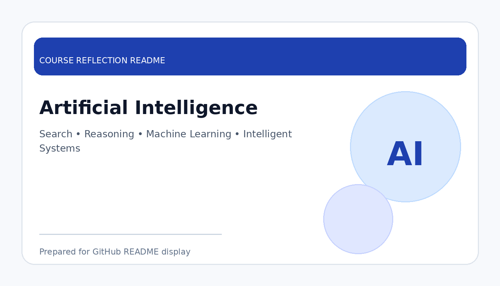

# Artificial Intelligence

  

  <b>Course Reflection README</b>

---

## Course Overview

This course introduces the fundamental concepts of artificial intelligence, including intelligent agents, problem-solving, search strategies, knowledge representation, reasoning, and basic machine learning concepts.

---

## Reflection

Artificial Intelligence helped me understand how computers can be designed to solve problems, make decisions, and behave intelligently. Before learning this course, I viewed AI mainly as a modern technology trend, but this subject helped me understand the logic, methods, and algorithms behind intelligent systems.

Through this course, I learned about problem-solving techniques, search algorithms, reasoning, and how machines can learn from data. These topics helped me realise that AI is not only about automation, but also about building systems that can analyse situations and support better decision-making.

Overall, this course strengthened my interest in intelligent technologies. It is very useful for my future because AI is closely related to data engineering, analytics, machine learning, and many real-world applications in industry.

---

## Key Takeaways

- Understood the basic concepts of artificial intelligence.
- Learned how search and reasoning support problem-solving.
- Improved awareness of AI applications in real life.
- Built foundation for machine learning and intelligent systems.

---

## Conclusion

In conclusion, **Artificial Intelligence** has provided useful knowledge and skills that are important for my academic development and future career. The course helped me improve my understanding, strengthen my learning foundation, and become more prepared to apply these concepts in real-world and professional situations.
