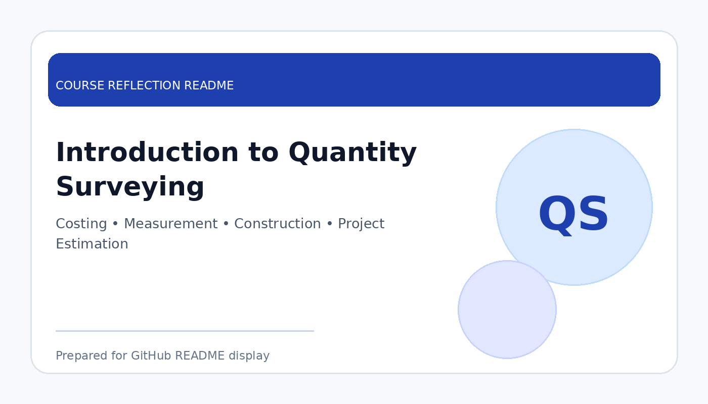

# Business Intelligence

  

  <b>Course Reflection README</b>

---

## Course Overview

This course introduces the concepts and practices of business intelligence, including data preparation, data modelling, dashboard development, data visualisation, and insight generation to support better decision-making.

---

## Reflection

This course helped me understand how raw data can be transformed into meaningful business insights. By learning business intelligence concepts, I became more aware of how organisations use data to monitor performance, identify patterns, and make informed decisions.

Through the course activities, I gained experience in preparing datasets, designing visual reports, creating dashboards, and presenting findings clearly. I also learned that a good dashboard is not only about visual appearance, but also about telling a clear story, highlighting important metrics, and helping users understand the situation quickly.

Overall, Business Intelligence improved my ability to analyse data from a business perspective. It strengthened my skills in data visualisation, reporting, and analytical thinking, which are important for data engineering, analytics, and decision-support systems.

---

## Key Takeaways

- Learned how business intelligence supports decision-making.
- Practised data preparation, dashboard design, and visual analytics.
- Understood the importance of KPIs, trends, and business storytelling.
- Improved analytical thinking and data presentation skills.

---

## Conclusion

In conclusion, **Business Intelligence** has helped me develop practical knowledge in turning data into useful insights. The course improved my ability to design meaningful dashboards, interpret business data, and communicate findings effectively for real-world decision-making.
