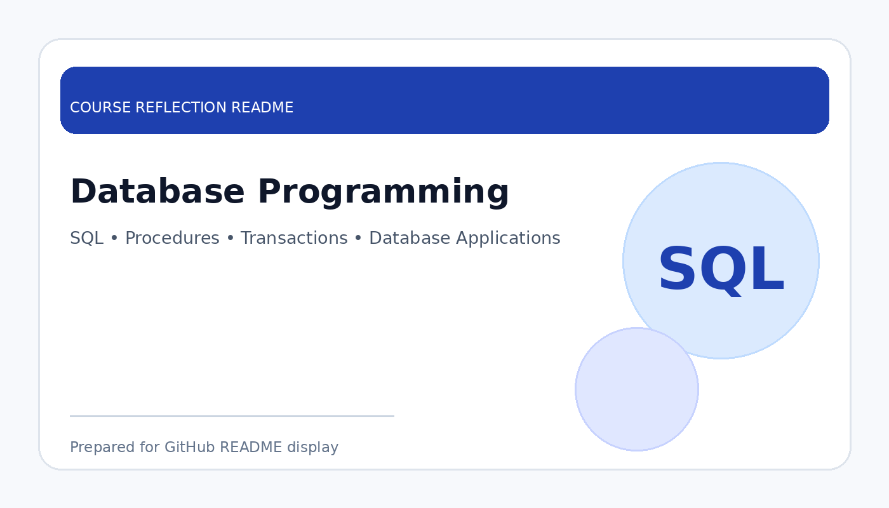

# Database Programming

  

  <b>Course Reflection README</b>

---

## Course Overview

This course focuses on applying programming techniques in database environments, including SQL, stored procedures, triggers, transactions, database connectivity, and application-based data operations.

---

## Reflection

Database Programming helped me understand how databases can be used together with programming to support real applications. Instead of only learning database theory, this course showed me how data can be inserted, updated, retrieved, and controlled through structured database programming.

The course improved my understanding of SQL, procedures, transactions, and database logic. It also helped me see the importance of data consistency, security, and accuracy when developing systems that depend on databases.

Overall, this course strengthened my practical database skills. It is highly relevant to my data engineering pathway because database programming is important for backend systems, data processing, reporting, and enterprise applications.

---

## Key Takeaways

- Improved practical SQL and database programming skills.
- Understood procedures, transactions, and database logic.
- Learned the importance of data consistency and accuracy.
- Built stronger foundation for backend and data engineering work.

---

## Conclusion

In conclusion, **Database Programming** has provided useful knowledge and skills that are important for my academic development and future career. The course helped me improve my understanding, strengthen my learning foundation, and become more prepared to apply these concepts in real-world and professional situations.
