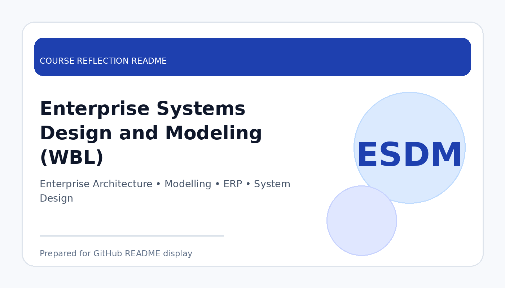

# Enterprise Systems Design and Modeling (WBL)

  

  <b>Course Reflection README</b>

---

## Course Overview

This course introduces enterprise system concepts, system modelling, enterprise architecture, business processes, and the design of large-scale information systems for organisational needs.

---

## Reflection

Enterprise Systems Design and Modeling helped me understand how information systems are planned and designed at an organisational level. The course showed me that enterprise systems are not only technical solutions, but also tools that support business processes, decision-making, and organisational improvement.

Through this course, I learned about enterprise architecture, system modelling, business process analysis, and enterprise system design. These topics helped me see how different components of an organisation can be connected through proper system planning and modelling.

Overall, this course improved my ability to think from both technical and business perspectives. It is useful for future system development work because enterprise systems require clear requirements, structured design, and strong understanding of organisational needs.

---

## Key Takeaways

- Understood the role of enterprise systems in organisations.
- Learned system modelling and enterprise architecture concepts.
- Improved ability to connect business needs with system design.
- Built awareness of large-scale system planning and implementation.

---

## Conclusion

In conclusion, **Enterprise Systems Design and Modeling (WBL)** has provided useful knowledge and skills that are important for my academic development and future career. The course helped me improve my understanding, strengthen my learning foundation, and become more prepared to apply these concepts in real-world and professional situations.
