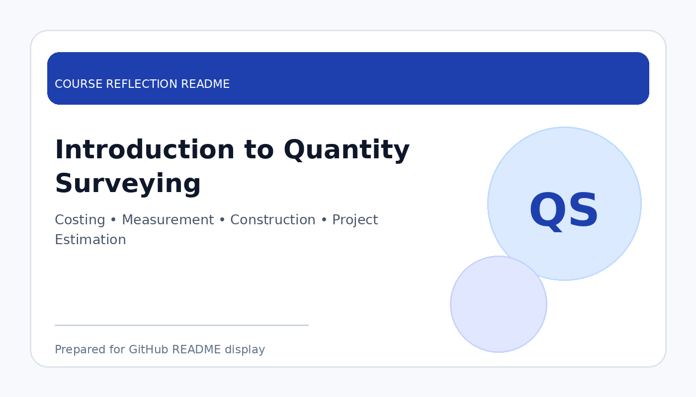

# Entrepreneurship and Innovation

  

  <b>Course Reflection README</b>

---

## Course Overview

This course covers the basic principles of entrepreneurship, innovation, business planning, value creation, customer needs, marketing, financial awareness, and the process of developing ideas into practical business opportunities.

---

## Reflection

This course helped me understand that entrepreneurship is not only about starting a business, but also about identifying problems, creating value, and developing solutions that meet customer needs. It encouraged me to think creatively and evaluate ideas from both practical and business perspectives.

Through the course, I learned about business models, innovation strategies, customer validation, marketing approaches, and teamwork in entrepreneurial projects. These activities helped me understand the importance of planning, communication, risk management, and adapting ideas based on feedback.

Overall, Entrepreneurship and Innovation improved my confidence in presenting ideas and solving problems creatively. It also showed me how technical skills can be combined with business thinking to create solutions that are useful and sustainable.

---

## Key Takeaways

- Learned the basics of entrepreneurship and innovation.
- Understood how to identify customer needs and create value.
- Practised business planning, teamwork, and idea presentation.
- Improved creativity, communication, and problem-solving skills.

---

## Conclusion

In conclusion, **Entrepreneurship and Innovation** has helped me develop a more creative and business-oriented mindset. The course strengthened my ability to think beyond technical solutions and consider how ideas can bring value to users, customers, and society.
