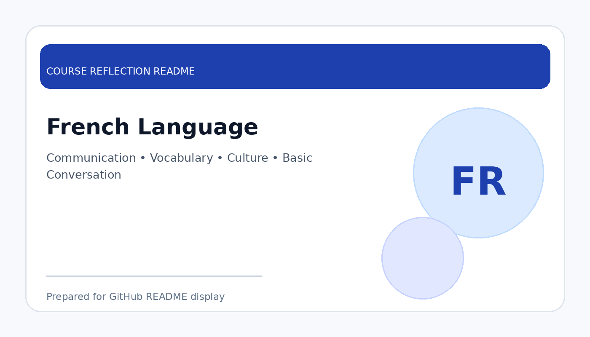

# French Language

  

  <b>Course Reflection README</b>

---

## Course Overview

This course introduces basic French language skills, including vocabulary, pronunciation, grammar, simple conversation, and cultural understanding.

---

## Reflection

French Language gave me the opportunity to learn a new language and understand a different culture. This course helped me realise that language learning is not only about memorising words, but also about improving communication, confidence, and cultural awareness.

Through this course, I learned basic French vocabulary, pronunciation, simple sentence structures, and daily conversation. Although learning a new language can be challenging, it trained me to be more patient and consistent in practice.

Overall, this course broadened my learning experience beyond technical subjects. It helped me appreciate cultural diversity and improved my ability to communicate in a more open and respectful way.

---

## Key Takeaways

- Learned basic French vocabulary and pronunciation.
- Improved confidence in simple foreign language communication.
- Developed patience and consistency in language learning.
- Gained better appreciation of culture and diversity.

---

## Conclusion

In conclusion, **French Language** has provided useful knowledge and skills that are important for my academic development and future career. The course helped me improve my understanding, strengthen my learning foundation, and become more prepared to apply these concepts in real-world and professional situations.
