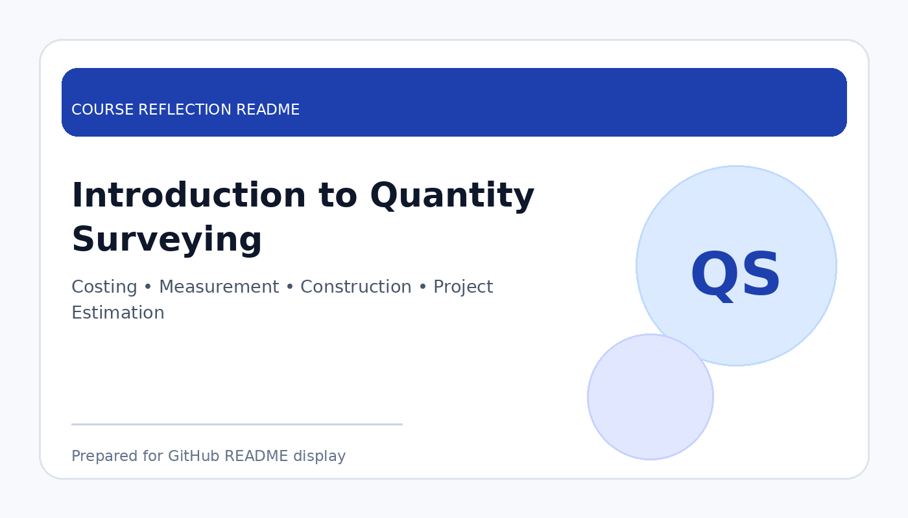

# High Performance Data Processing

  

  <b>Course Reflection README</b>

---

## Course Overview

This course focuses on efficient techniques for processing large datasets. It covers performance-aware data handling, memory optimisation, scalable processing methods, and the use of tools or libraries that can improve speed and efficiency in data analysis workflows.

---

## Reflection

This course helped me understand the challenges of handling large datasets and the importance of choosing the right processing approach. I learned that data processing is not only about getting correct results, but also about improving runtime, reducing memory usage, and making the workflow more scalable.

Through practical work, I explored techniques such as loading selected columns, optimising data types, using chunking, sampling, and comparing different processing tools. These activities showed me how different tools may perform better in different situations depending on dataset size, memory limitations, and analysis requirements.

Overall, High Performance Data Processing strengthened my understanding of scalable data engineering practices. It helped me become more aware of performance issues and improved my ability to design efficient data workflows for real-world data processing tasks.

---

## Key Takeaways

- Learned techniques for improving data processing performance.
- Understood the importance of runtime and memory optimisation.
- Practised handling large datasets using scalable methods.
- Improved the ability to compare tools based on practical scenarios.

---

## Conclusion

In conclusion, **High Performance Data Processing** has provided important knowledge for working with large and complex datasets. The course helped me improve my technical judgement, performance awareness, and readiness to build efficient data processing solutions in future data engineering work.
