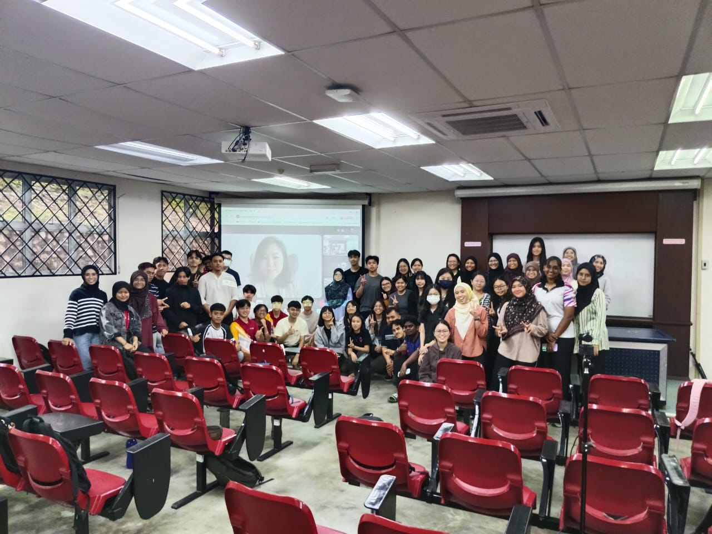

# ☁️ Industrial Talk: iZeno Technical Seminar

## 📌 Talk Summary
* **Organization:** iZeno (An elite technology enterprise specialized in Cloud-Native Solutions, DevOps, and Data Automation)
* **Objective:** To dissect enterprise Cloud-Native architectures, microservices orchestration, and modern data-layer transformation protocols.
* **Key Focus:** Containerization matrices, hybrid-cloud enterprise designs, automated CI/CD infrastructure, and real-time streaming data strategies.

The iZeno technical engagement provided a deep-dive seminar showcasing how enterprise organizations migrate legacy database structures into resilient, cloud-native ecosystems. The speakers detailed real-world application modernizations, demonstrating how modern business workflows decouple monolithic systems into agile, containerized microservices. This migration is vital to establishing high-availability data infrastructure capable of scaling processing resources dynamically during massive transaction spikes.

---

## 📸 Evidence of Engagement
Below is the placeholder framework for the verified group photograph taken during the iZeno corporate engagement session:

  
   
  <i>Figure 1: Universiti Teknologi Malaysia (UTM) Year 3 Data Engineering Cohort attending the specialized cloud infrastructure seminar hosted by iZeno.</i>

---

## 🧠 Reflection

### What I Learnt
* This session with iZeno provided a crucial technical link regarding how high-performance data frameworks are actually managed in production. Prior to this talk, I viewed tools like **Docker** primarily as isolated sandboxes for running local application tests. iZeno mapped out how containerized orchestration is the absolute bedrock of modern, enterprise-scale data engineering.

* Learning how companies scale microservices showed me that database and analytics engines cannot remain tied to fixed physical machines. By containerizing ingestion steps and analytics modules, data teams can treat computational power as a fluid resource. If a pipeline experiences a sudden surge in unstructured data logs, orchestration layers can automatically spin up identical container units to handle the computing load, shutting them down gracefully when processing wraps up.
