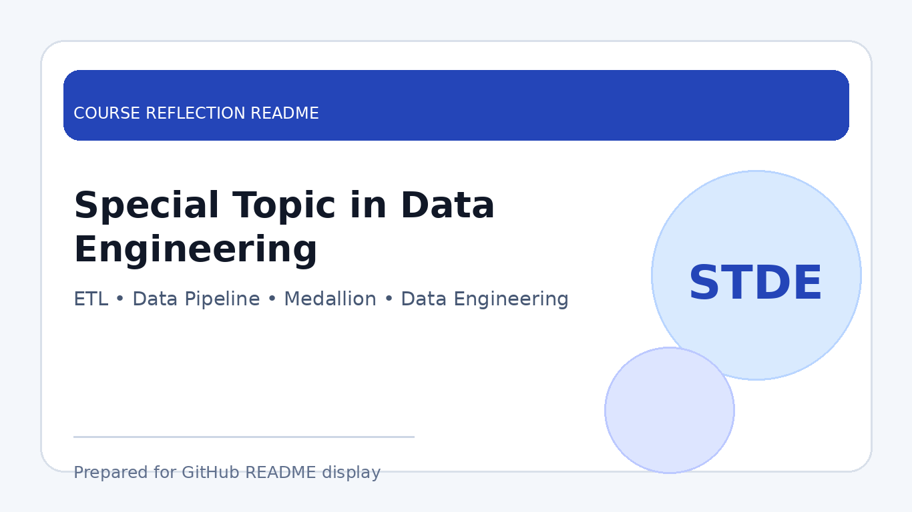

# Special Topic in Data Engineering

  

  <b>Course Reflection README</b>

  
  

---

## Course Overview

**Special Topic in Data Engineering** introduces selected and current topics related to the data engineering field. The course focuses on modern data technologies, data pipeline concepts, data integration, data transformation, artificial intelligence support in data workflows, cloud-based tools, and practical approaches for managing data in real-world environments.

Through tutorials, industrial talks, project demonstrations, e-portfolio preparation, and individual project activities, this course helped strengthen the connection between theoretical data engineering concepts and practical implementation.

---

## Learning Focus

| Focus Area | Description |
|---|---|
| Data Engineering Concepts | Understanding data pipeline, data architecture, ETL, ELT, and data workflow design |
| Big Data & Processing | Exposure to Apache Spark, CRISP methodology, and scalable data handling concepts |
| AI-Assisted Data Engineering | Understanding how AI and GenAI can support data engineering tasks and improve workflows |
| Project Implementation | Applying concepts through project pre-demo, final demo, report writing, and video presentation |
| Research & Paper Writing | Identifying data, selecting data architecture, writing introduction, literature review, methodology, implementation, discussion, and conclusion |

---

## Course Timeline

> This timeline summarises the weekly learning activities, tutorials, talks, demos, submissions, and final project requirements throughout the course.

| Date | Day | Activity | Description |
|---|---|---|---|
| **13 May 2026** | Wednesday | Industrial Talk from Izeno | Exposure to industry practices and current technology applications related to data and enterprise solutions. |
| **19 May 2026** | Tuesday | Tutorial 2: Apache Spark & CRISP | Learned about Apache Spark concepts and the CRISP methodology for data-related project workflows. |
| **20 May 2026** | Wednesday | Industrial Talk from TM | Gained insights from TM regarding technology, data, digital infrastructure, and industry implementation. |
| **27 May 2026** | Wednesday | Cuti Raya Haji | Public holiday / no formal class session. |
| **3 June 2026** | Wednesday | Mid-Term Test | Mid-term assessment held at **Dewan Kejora**, covering all topics from the textbook. |
| **9 June 2026** | Tuesday | Project Pre-Demo | Presented the project progress with draft report sections covering **Chapter 1, 2, 3, 4, and 5**. |
| **10 June 2026** | Wednesday | Tutorial 3: Data Pipeline & AI Demo | Focused on data pipeline concepts and AI demo, including improvement of algorithm-related work. |
| **16 June 2026** | Tuesday | Tutorial 4: GenAI Demo | Online demo for Tutorial 4 related to GenAI. Submission was completed in eLearning on **15 June 2026**. |
| **16 June 2026** | Tuesday | Final Project Report | Final project report submission. |
| **19 June 2026** | Friday | Final Project Presentation | Physical presentation at **9:30 AM, Bilik KM Aras 4, N28**. Format: **3 minutes presentation + 3 minutes demo video + 3 minutes Q&A**. |
| **23 June 2026** | Tuesday | E-Portfolio Demo | Online e-portfolio demo. E-portfolio link submitted in eLearning on **22 June 2026**. |
| **24 June 2026** | Wednesday | Individual Project Proposal Presentation | Physical presentation for the individual project. Each student presented for **2 minutes**, covering data identification, data type, data architecture, draft paper, introduction, literature review, and methodology. Submission was completed in eLearning on **23 June 2026**. |
| **25 June 2026** | Thursday | Individual Project Instruction Release | Full instructions for the individual project were released. |
| **9 July 2026** | Thursday | Individual Project Paper Submission | Full individual project paper submission in eLearning. |
| **10 July 2026** | Friday | Individual Project Presentation & Demo | Physical presentation and demo for the individual project, including paper sections: introduction, literature review, methodology, implementation, discussion, and conclusion. |

---

## Important Deliverables

| Deliverable | Requirement |
|---|---|
| Tutorial 2 | Apache Spark & CRISP |
| Tutorial 3 | Data Pipeline and AI Demo |
| Tutorial 4 | GenAI Online Demo |
| Project Pre-Demo | Draft report Chapter 1 to Chapter 5 |
| Final Project Report | Full project report submission |
| Final Project Presentation | 3 minutes presentation, 3 minutes video demo, 3 minutes Q&A |
| E-Portfolio | Link submission and online demo |
| Individual Project Proposal | Data identification, data type, data architecture, draft paper, introduction, literature review, and methodology |
| Individual Project Final Paper | Introduction, literature review, methodology, implementation, discussion, and conclusion |
| Individual Project Presentation | Physical presentation and demo |

---

## Reflection

This course helped me gain exposure to modern data engineering practices and technologies. It allowed me to understand how data moves from different sources into storage, processing, transformation, and analytics layers. This improved my understanding of how data engineering supports business intelligence, automation, and decision-making.

Through the course activities, I learned about the importance of building reliable data pipelines, handling data quality, organising data layers, and using suitable tools for data integration and processing. The tutorials on Apache Spark, CRISP, data pipeline, AI demo, and GenAI also helped me understand how modern tools and artificial intelligence can support data engineering work.

The project activities trained me to explain technical workflows clearly through reports, demo videos, presentations, and e-portfolio documentation. The individual project also helped me practise research-based writing, especially in identifying data, choosing data architecture, and preparing sections such as introduction, literature review, methodology, implementation, discussion, and conclusion.

Overall, Special Topic in Data Engineering strengthened my interest in data pipelines, ETL processes, AI-assisted data engineering, cloud-based data platforms, and real-world data solutions. It helped me connect theoretical knowledge with practical implementation in the data engineering field.

---

## Key Takeaways

- Learned about modern concepts and current practices in data engineering.
- Understood the role of data pipelines, ETL, data transformation, and data architecture.
- Gained exposure to Apache Spark, CRISP methodology, AI demo, and GenAI-related workflow.
- Improved awareness of data quality, integration, cloud-based tools, and workflow design.
- Strengthened technical communication through reports, demo videos, presentation, and e-portfolio.
- Improved readiness for practical and research-based data engineering projects.

---

## Skills Developed

| Skill Category | Skills |
|---|---|
| Technical Skills | Data pipeline, ETL concepts, data architecture, Apache Spark basics, AI-assisted workflow |
| Analytical Skills | Data identification, workflow analysis, methodology planning, project evaluation |
| Documentation Skills | Report writing, README preparation, paper structure, reflection writing |
| Presentation Skills | Project demo, video explanation, Q&A preparation, e-portfolio presentation |
| Professional Skills | Time management, task planning, teamwork, communication, project responsibility |

---

## Conclusion

In conclusion, **Special Topic in Data Engineering** has helped me better understand current practices and technologies in the data engineering field. The course provided useful exposure through tutorials, industry talks, project development, e-portfolio preparation, and individual project work.

This course strengthened my foundation in data engineering and improved my ability to connect technical knowledge with practical implementation. It also prepared me to handle future projects involving data pipelines, AI-assisted workflows, data architecture, and real-world data solutions.

---

  <b>Prepared by Elijah She Yu Sheng</b> 
  Bachelor of Computer Science (Data Engineering) 
  Universiti Teknologi Malaysia

